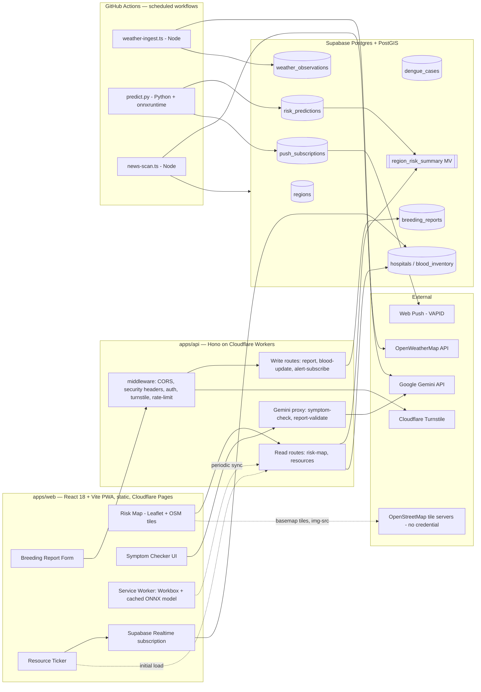

# Avash (আভাস) — সুরক্ষার আগাম বার্তা (Shurokkhar Agam Barta) | Engineering Blueprint (Single Source of Truth)

*Prepared as the canonical reference for all human and AI-agent contributors. Every implementation decision, PR, and doc update must trace back to this document. If code and this doc disagree, this doc wins until updated in the same PR.*

> **Correction log:** Frontend is **React 18 + Vite** (client-rendered SPA/PWA), **not Next.js**. This removes server-rendering and file-based API routes from the frontend app entirely, which changes where secret-touching logic, middleware, and background jobs live. See §1, §3, and ADR-007/008 for the full architectural consequence of this change — it is not a cosmetic swap.

---

## 0. Ground Rules (Read First)

1. **Vertical slices only.** One feature, fully working end-to-end (DB → API → UI → docs → 3 manual tests → automated tests), before starting the next. See §14 for slice order.
2. **Secrets never touch the client.** `apps/web` is a static SPA shipped to the browser — it must never import, bundle, or reference a non-`VITE_PUBLIC_`-prefixed secret. Anything touching Gemini, Supabase service role, OpenWeatherMap, Upstash, Turnstile secret, or VAPID private keys lives in `apps/api` (Cloudflare Worker) or in GitHub Actions job scripts — never in `apps/web`.
3. **One types source.** All shared TS interfaces/DTOs/zod schemas live in `packages/types`. No inline duplicate interfaces anywhere else.
4. **Optional chaining is mandatory** on every external/untrusted access point: `fetch()` responses, Supabase query results, `JSON.parse`, `localStorage`/`IndexedDB`, browser Geolocation/Notification/Push APIs, third-party SDK callbacks (Leaflet map/layer/marker events), Gemini responses. PR reviewers must grep for raw `.property` access on any of these before approval.
5. **Docs are code.** A PR that changes behavior without updating `docs/` is incomplete, not "done later."
6. **Engineering correction from brief:** true per-request ML inference *inside* a Cloudflare Worker at the free tier is not realistic (10ms CPU-time cap on the free plan applies to actual compute, not I/O wait — WASM tensor math is compute-bound and will blow the cap across many regions). §5.3 documents the honest, working architecture that still satisfies the "zero-cost, edge, near-0ms perceived latency" goal.
7. **No SSR.** `apps/web` is a client-rendered SPA. Public risk-map SEO is a deliberately accepted trade-off (ADR-008) — do not attempt to bolt on server rendering piecemeal; if it's ever needed, it gets its own ADR and migration plan.

---

## 1. Repository Layout

```
.
├── .agents/                       # Machine-readable agent task contracts
├── .claude/                       # Claude project settings + reusable skills
├── .codex/                        # Codex CLI config
├── .cursor/                       # Cursor MCP server config
├── .devcontainer/                 # Optional dev container — toolchain only; apps still run on the host (ADR-011)
├── .github/
│   ├── workflows/
│   │   ├── ci.yml                 # lint → typecheck → unit test → build (both apps)
│   │   ├── codeql.yml             # SAST, weekly + on PR
│   │   ├── deploy-web.yml         # Vite build → Cloudflare Pages
│   │   ├── deploy-api.yml         # Wrangler deploy → Cloudflare Workers
│   │   ├── cron-weather-ingest.yml   # scheduled: OpenWeatherMap → Supabase
│   │   ├── cron-batch-predict.yml    # scheduled: ONNX inference → Supabase + push alerts
│   │   ├── cron-news-scan.yml        # scheduled: news scrape → Gemini classify → Supabase
│   │   └── build-images.yml          # build + scan + publish the two app images to GHCR (ADR-012)
│   └── dependabot.yml             # weekly npm + pip + actions + docker updates
├── apps/
│   ├── web/                       # React 18 + Vite PWA — pure static SPA, Cloudflare Pages
│   │   ├── src/
│   │   │   ├── pages/              # RiskMap, Report, Weather, Resources, SymptomChecker, admin/*
│   │   │   ├── features/           # map/, reports/, resources/, symptom-checker/, alerts/ (feature-sliced)
│   │   │   ├── components/         # dumb/presentational, app-specific (not shared design system)
│   │   │   ├── lib/                # supabaseClient.ts, apiClient.ts, queryClient.ts, onnxClient.ts
│   │   │   ├── hooks/               # useGeolocation, useOnlineStatus, usePushSubscription, etc.
│   │   │   ├── router.tsx           # React Router route tree + lazy-loaded route guards
│   │   │   ├── App.tsx
│   │   │   └── main.tsx
│   │   ├── public/                 # manifest.webmanifest, icons, offline.html, _headers, _redirects
│   │   ├── docker/                 # nginx server block + security-headers snippet for the image
│   │   ├── Dockerfile              # multi-stage: node build → nginx-unprivileged serving dist/ (ADR-012)
│   │   ├── vite.config.ts          # vite-plugin-pwa (Workbox) + bundle-analyzer + env validation
│   │   └── index.html
│   └── api/                        # Hono on Cloudflare Workers — ALL secret-touching request logic
│       ├── src/
│       │   ├── routes/              # risk-map.ts, resources.ts, reports.ts, symptom-check.ts, alerts.ts
│       │   ├── middleware/          # cors.ts, security-headers.ts, rate-limit.ts, turnstile.ts, auth.ts
│       │   ├── lib/                 # supabaseAdmin.ts, geminiClient.ts, jwtVerify.ts
│       │   └── index.ts             # Hono app entry, route mounting — the ONE app object both runtimes serve
│       ├── server/                  # node-server.ts — @hono/node-server adapter for the image only (ADR-012)
│       ├── Dockerfile               # multi-stage: esbuild bundle → node:alpine running server.js
│       ├── wrangler.toml
│       └── package.json
├── ml/                              # OFFLINE pipeline — Python, never deployed as a live app
│   ├── notebooks/                   # EDA (throwaway)
│   ├── training/                    # feature_engineering.py, train.py, export_onnx.py, config.py
│   ├── evaluation/                  # backtest.py (walk-forward CV), model_card.py
│   ├── serving/                     # predict.py — batch inference, run by cron-batch-predict.yml
│   └── data/                        # DVC pointers only — raw CSVs gitignored
├── packages/
│   ├── types/                       # single canonical source — domain.ts, api.ts, ml.ts (barrel index.ts)
│   ├── config/                      # eslint-config, tsconfig base, tailwind-preset
│   ├── ui/                          # shared React design system (framework-agnostic of routing)
│   ├── db/                          # supabase/migrations/*.sql, RLS policies, generated Supabase types
│   ├── geo/                         # PostGIS query builders (ST_DWithin, bbox clip), turf.js helpers
│   ├── ml-inference/                # model.onnx (versioned), onnxruntime-web wrapper for browser use
│   ├── security/                    # rate-limiter (Upstash), turnstile verifier, prompt-injection guard, zod schemas
│   └── logger/                      # pino structured logger + PII redaction
├── scripts/
│   ├── setup.sh
│   ├── seed-db.ts
│   ├── refresh-materialized-views.ts
│   └── jobs/
│       ├── weather-ingest.ts        # Node/TS — called by cron-weather-ingest.yml
│       └── news-scan.ts             # Node/TS — called by cron-news-scan.yml
├── docker/                          # Shared infra images (ADR-011). Per-app Dockerfiles live in apps/* (ADR-012)
│   ├── ml.Dockerfile                # Python 3.11 runtime for ml/ — batch container, never a deployed service
│   └── postgis/initdb/              # Extension enablement on first boot (postgis, pgcrypto); no schema objects
├── docs/
│   ├── adr/
│   ├── standards/
│   ├── data-schema/
│   ├── ml/
│   ├── security/
│   └── docker.md                    # Container runbook: local DB, ML image, dev container, CI images
├── AGENTS.md
├── CLAUDE.md
├── CONTRIBUTING.md
├── SECURITY.md
├── compose.yaml                     # Services: db + ml (infra), web + api behind the `apps` profile (ADR-012)
├── .dockerignore                    # Keeps .env / .dev.vars and build output out of every build context
├── package.json
├── pnpm-workspace.yaml
└── turbo.json
```

**Why two apps now, not one?** A React SPA has no server. Every piece of logic that must stay off the client — Gemini calls, Supabase service-role writes, rate limiting, Turnstile verification — needs an actual backend. `apps/api` (Hono on Cloudflare Workers) is that backend: lightweight, edge-deployed, and free-tier friendly for **I/O-bound** work (DB reads/writes, calling Gemini). CPU-**bound** work (ONNX batch inference across every region) is deliberately kept *out* of the Worker and run instead as scheduled GitHub Actions jobs talking directly to Supabase — see ADR-002 and ADR-007.

---

## 2. Architectural Decision Records (Summary)

| ADR | Decision | Rationale |
|---|---|---|
| ADR-001 | Two-app split: `apps/web` (React SPA) + `apps/api` (Hono/Workers) | React has no backend of its own; secret-touching logic needs a real server. Splitting keeps the frontend a pure static bundle (cheap, cacheable, CDN-friendly) and the backend a minimal, auditable surface |
| ADR-002 | **Batch inference (Python, GitHub Actions), not per-request edge inference** | Cloudflare Workers free tier CPU-time cap (~10ms **compute**, not I/O-wait) can't reliably host WASM ONNX inference across many regions per request. Real design: a scheduled GitHub Actions job (`ml/serving/predict.py`, standard Python + `onnxruntime`) computes `risk_predictions` on a cron, writing directly to Supabase. Client-side ONNX inference (`onnxruntime-web`) ships inside the PWA for **offline, on-device** personal re-scoring — this is where "edge/0-latency AI" honestly lives |
| ADR-003 | PostGIS over generic lat/lng columns | Native `ST_DWithin`, GiST indexing, and polygon containment needed for region + proximity queries |
| ADR-004 | Deterministic rule engine for symptom triage; LLM only structures/paraphrases | No LLM hallucination in a health-safety-critical path |
| ADR-005 | Anonymous + authenticated breeding reports allowed, gated by Turnstile + rate limit, not by login wall | Maximizes citizen reporting volume; abuse controlled at network layer, not identity layer |
| ADR-006 | Materialized view `region_risk_summary` for map reads | Avoids recomputing joins/spatial aggregation on every map pan/zoom |
| ADR-007 | **GitHub Actions `schedule` cron replaces Upstash QStash** for all background jobs (weather ingest, batch predict, news scan) | GH Actions is free, has no CPU-time ceiling relevant here, runs real Node/Python runtimes, and needs zero extra infra account. Upstash Redis is retained, but scoped strictly to **rate limiting** (a genuinely edge-appropriate KV counter used inside `apps/api` request handling) |
| ADR-008 | **No SSR** — `apps/web` is a pure client-rendered SPA | React (not Next.js) has no built-in server rendering story worth adopting here. Trade-off accepted: the public risk map is not search-engine-crawlable at launch. If SEO becomes a priority, revisit via a dedicated ADR (e.g., prerendering just the landing route) — do not silently bolt on SSR |
| ADR-009 | Auth = Supabase Auth (client SDK) + local JWT verification in the Worker | Supabase issues HS256 JWTs; `apps/api` verifies them locally against `SUPABASE_JWT_SECRET` (via `jose`) instead of round-tripping to Supabase Auth on every request — faster, still fully server-side |
| ADR-010 | Realtime resource ticker uses **Supabase Realtime** directly from the browser (not via `apps/api`) | `blood_inventory`/`hospitals` are public-read (RLS-gated), so subscribing directly with the anon key over `postgres_changes` is safe and removes an unnecessary hop |
| ADR-011 | **Docker for local infrastructure and ML reproducibility** — a PostGIS database, the Python ML runtime, and CI service containers. *(The "apps are never containerized" clause is superseded by ADR-012; everything else stands)* | Schema/RLS/spatial work needs a real PostGIS instance, and ONNX export is dependency-version-sensitive — both are worth a pinned container |
| ADR-012 | **Both apps ship container images**, built and published per app — `apps/web` on nginx serving the Vite build, `apps/api` on Node via `@hono/node-server`. Cloudflare Pages/Workers stays the primary deploy target | Images make the project portable, handover-ready, and self-hostable without a Cloudflare account or a local toolchain, and leave a SHA-tagged artifact per merge. The cost — `apps/api` now runs on both workerd and Node — is paid explicitly: CI runs `apps/api`'s Playwright suite against **both** runtimes, so a divergence is a red build, not a surprise for whoever self-hosts |
| ADR-013 | **Leaflet with OpenStreetMap raster tiles, no map credential** — the basemap comes from `tile.openstreetmap.org`; region polygons and markers are drawn from our own `apps/api` GeoJSON on top of it | Splits "map library" from "tile provider," which §7.1 had previously conflated. Leaflet renders our dynamic layers without a WebGL dependency on low-end hardware, and OSM tiles remove `VITE_PUBLIC_MAPBOX_TOKEN` — along with its account, scoping procedure, and rotation path — from the project entirely. The tile source is one registry constant plus one CSP `img-src` entry, so moving to a keyed or self-hosted provider under real traffic is a swap, not a rewrite |
| ADR-016 | **A third deployable app, `apps/notify`** (Vercel + Inngest), for live announcement push | Announcement delivery is neither a per-request browser call nor a fixed-cadence batch job — it needs durable retries and per-subscriber fan-out triggered by a database write. All delivery logic lives in `packages/push` (no Vercel/Inngest imports), so `apps/notify` stays a thin, re-hostable adapter and the vendor bet is a deployment detail, not a structural commitment |

New decisions get a new file in `docs/adr/`, numbered sequentially, never edited retroactively (superseded ADRs are marked, not deleted).

---

## 3. System Architecture



**Data flow, plain English:**
1. Every 3h, `cron-weather-ingest.yml` runs `scripts/jobs/weather-ingest.ts` (Node), pulls OpenWeatherMap data per region, writes to `weather_observations` using the Supabase service-role key (stored as a GitHub Actions secret — never in any deployed app).
2. Every 24h, `cron-batch-predict.yml` runs `ml/serving/predict.py`: loads the checksum-verified `.onnx` model, builds feature vectors per region straight from Supabase, runs `onnxruntime` (Python) inference, writes `risk_predictions`, refreshes `region_risk_summary`, and — for any region crossing into `high`/`severe` — sends Web Push notifications to matching `alert_subscriptions`/`push_subscriptions` via VAPID.
3. The map, dashboard, and resource pages (`apps/web`) read only from the materialized view / indexed tables through `apps/api` — fast, cacheable, cheap.
4. Citizen writes (breeding report, blood update) go through `apps/api`: Turnstile + rate limiter + Gemini-assisted validation before landing in Postgres, subject to RLS.
5. The **blood/hospital ticker** subscribes directly to Supabase Realtime from the browser for live updates (ADR-010) — no polling, no extra Worker load.
6. The PWA service worker caches the last-synced regional feature snapshot + the ONNX model so a returning user gets an **offline, on-device** personal risk estimate — this is the genuine "edge AI" experience, running entirely in the user's browser via WASM.

---

## 4. Data Layer — PostGIS Schema

```sql
create extension if not exists postgis;
create extension if not exists pgcrypto;

-- Administrative boundaries
create table regions (
  id uuid primary key default gen_random_uuid(),
  code text unique not null,
  name text not null,
  admin_level smallint not null,        -- 1=state 2=district 3=ward
  population integer,
  geom geometry(MultiPolygon, 4326) not null
);
create index idx_regions_geom on regions using gist (geom);

-- Weather ingestion (append-only)
create table weather_observations (
  id bigint generated always as identity primary key,
  region_id uuid references regions(id) on delete cascade on update cascade,
  observed_at timestamptz not null,
  temp_mean_c numeric(4,1),
  temp_min_c numeric(4,1),
  temp_max_c numeric(4,1),
  humidity_pct numeric(4,1),
  precipitation_mm numeric(6,1),
  source text default 'openweathermap',
  raw_payload jsonb
);
create index idx_weather_region_time on weather_observations (region_id, observed_at desc);

-- Historical epidemiological ground truth (weekly aggregates)
create table dengue_cases (
  id bigint generated always as identity primary key,
  region_id uuid references regions(id) on delete cascade on update cascade,
  reported_week date not null,          -- ISO week start (Monday)
  case_count integer not null check (case_count >= 0),
  source text
);
create unique index uq_cases_region_week on dengue_cases (region_id, reported_week);

-- Model output (2 rows per region per run: horizon=2, horizon=4)
create table risk_predictions (
  id bigint generated always as identity primary key,
  region_id uuid references regions(id) on delete cascade on update cascade,
  prediction_date date not null,
  horizon_weeks smallint not null check (horizon_weeks in (2, 4)),
  risk_score numeric(4,3) not null check (risk_score between 0 and 1),
  risk_level text generated always as (
    case when risk_score < 0.25 then 'low'
         when risk_score < 0.50 then 'moderate'
         when risk_score < 0.75 then 'high'
         else 'severe' end
  ) stored,
  top_factors jsonb,                    -- SHAP top-3 contributing features, for explainability UI
  model_version text not null,
  generated_at timestamptz default now(),
  unique (region_id, horizon_weeks, prediction_date)
);
create index idx_predictions_region_date on risk_predictions (region_id, prediction_date desc);

-- Read-optimized surface for the map (refreshed by the batch-predict job, not on request path)
create materialized view region_risk_summary as
  select distinct on (r.id, p.horizon_weeks)
         r.id as region_id, r.name, r.geom,
         p.risk_score, p.risk_level, p.horizon_weeks, p.generated_at
  from regions r
  join risk_predictions p on p.region_id = r.id
  order by r.id, p.horizon_weeks, p.prediction_date desc;
create unique index uq_summary_region_horizon on region_risk_summary (region_id, horizon_weeks);
create index idx_summary_geom on region_risk_summary using gist (geom);
-- refreshed via: refresh materialized view concurrently region_risk_summary;

-- Citizen-submitted breeding site reports
create table breeding_reports (
  id uuid primary key default gen_random_uuid(),
  reporter_id uuid references auth.users(id) on delete set null on update cascade,
  geom geometry(Point, 4326) not null,
  description text,
  photo_url text,
  ai_validation jsonb,                  -- Gemini structured-output payload
  status text not null default 'pending'
    check (status in ('pending','verified','rejected','resolved')),
  verified_by uuid references auth.users(id) on delete set null on update cascade,
  municipal_ref_id text,
  created_at timestamptz default now()
);
create index idx_breeding_geom on breeding_reports using gist (geom);
create index idx_breeding_pending on breeding_reports (status) where status = 'pending';

-- Medical resources
create table hospitals (
  id uuid primary key default gen_random_uuid(),
  name text not null,
  geom geometry(Point, 4326) not null,
  address text,
  phone text,
  verified boolean default false,
  updated_at timestamptz default now()
);
create index idx_hospitals_geom on hospitals using gist (geom);

create type blood_group as enum ('A+','A-','B+','B-','AB+','AB-','O+','O-');

create table blood_inventory (
  id bigint generated always as identity primary key,
  hospital_id uuid references hospitals(id) on delete cascade on update cascade,
  blood_group blood_group not null,
  units_available integer not null default 0 check (units_available >= 0),
  platelet_units integer default 0 check (platelet_units >= 0),
  updated_by uuid references auth.users(id) on delete set null on update cascade,
  updated_at timestamptz default now(),
  unique (hospital_id, blood_group)
);

create table verified_hospital_staff (
  user_id uuid references auth.users(id) on delete cascade on update cascade,
  hospital_id uuid references hospitals(id) on delete cascade on update cascade,
  primary key (user_id, hospital_id)
);

-- Proximity alert subscriptions (geofence definition)
create table alert_subscriptions (
  id uuid primary key default gen_random_uuid(),
  user_id uuid references auth.users(id) on delete cascade on update cascade,
  geom geometry(Point, 4326) not null,
  radius_m integer not null default 2000 check (radius_m between 100 and 20000),
  active boolean default true,
  created_at timestamptz default now()
);
create index idx_alerts_geom on alert_subscriptions using gist (geom);

-- Web Push delivery targets (one browser subscription per device)
create table push_subscriptions (
  id uuid primary key default gen_random_uuid(),
  user_id uuid references auth.users(id) on delete cascade on update cascade,
  endpoint text not null unique,
  p256dh text not null,
  auth_key text not null,
  created_at timestamptz default now()
);

-- Author-broadcast announcements (§13.7 amendment; decision A — NOT
-- alert_subscriptions with a flag: inverse relationship, different owner,
-- different RLS)
create table announcements (
  id uuid primary key default gen_random_uuid(),
  author_id uuid references auth.users(id) on delete set null on update cascade,
  title text not null,
  body text not null,
  geom geometry(Point, 4326) not null,
  radius_m integer not null default 5000 check (radius_m between 500 and 50000),
  target_roles text[] not null default '{}',   -- empty = every role
  expires_at timestamptz not null,
  created_at timestamptz not null default now()
);
create index idx_announcements_geom on announcements using gist (geom);
create index idx_announcements_active on announcements (expires_at desc);

-- News aggregator agent output
create table news_items (
  id bigint generated always as identity primary key,
  source_url text unique not null,
  title text,
  published_at timestamptz,
  region_guess uuid references regions(id) on delete set null on update cascade,
  ai_confidence numeric(3,2),
  flagged boolean default false,
  reviewed boolean default false,
  created_at timestamptz default now()
);
```

### 4.1 Row Level Security (representative policies)

| Table | Policy | Rule |
|---|---|---|
| `breeding_reports` | insert | any role (incl. `anon`) — abuse handled by rate-limit + Turnstile in `apps/api`, not RLS |
| `breeding_reports` | select | `status = 'verified'` OR `reporter_id = auth.uid()` |
| `breeding_reports` | update | only `role() in ('moderator','admin')` |
| `blood_inventory` | select | public (`anon`) — required for direct Realtime subscription (ADR-010) |
| `blood_inventory` | update | `auth.uid() in (select user_id from verified_hospital_staff where hospital_id = blood_inventory.hospital_id)` |
| `alert_subscriptions`, `push_subscriptions` | all | `user_id = auth.uid()` only |
| `risk_predictions`, `hospitals` (select) | select | public (`anon`) |

Full policy SQL lives in `packages/db/supabase/migrations/`. RLS is **on** for every table by default; a table without RLS enabled must have an ADR justifying it.

**§4.1 amendment — `role()` never evaluates to `moderator`/`admin`.**
The table above (and migration `20260201000007_rls_policies.sql` as
originally written) gates moderator/admin policies on
`auth.role() in ('moderator','admin')`. `auth.role()` is a real Supabase
Auth function, but it returns the **PostgREST** role — `anon` or
`authenticated` — never a custom application role; there is no code path
by which it can equal `'moderator'` or `'admin'`. Every policy written
that way (`breeding_reports_update_moderation`,
`hospitals_{insert,update,delete}_admin`,
`verified_hospital_staff_{select,insert,delete}_admin`, and the two
`news_items_*` moderation/admin policies) was dead: syntactically valid,
never true. Migration `20260815000012_app_role_and_resource_reads.sql`
adds `public.app_role()`, reading the custom role from
`auth.jwt() -> 'app_metadata' ->> 'role'` (`APP_ROLE_CLAIM_PATH`, §14) —
the Supabase-idiomatic location for a server-controlled role, since
`app_metadata` cannot be set by the user, unlike `user_metadata` — and
replaces every one of those policies with an `app_role()` equivalent.
Read `app_role()` in the table above wherever `role()` appears.

### 4.2 Indexing & Query Discipline

- Every geometry column: **GiST index**, non-negotiable.
- Every "latest record per entity" query: composite index `(entity_id, timestamp desc)`.
- Every hot read path for the UI: served from a materialized view or covering index, never a live `ST_DWithin` join against raw tables on the request path.
- Statement timeout: `5s` enforced at the Supabase connection role level to prevent runaway spatial queries from starving the pool.

### 4.3 Foreign Key Action Policy

Every foreign key above declares its `on delete`/`on update` behavior
explicitly — never left to the Postgres default (`no action`), so a
`delete`/`update` against a parent row cannot fail with an opaque
constraint-violation error at runtime. `on insert` has no separate action
to declare: a foreign key is a constraint checked at `insert`/`update`
time — the referenced row must already exist, full stop — which is what
makes referential integrity enforcement automatic rather than
application-level.

| Child → Parent | `on delete` | `on update` | Why |
|---|---|---|---|
| `weather_observations.region_id → regions(id)` | `cascade` | `cascade` | Weather history has no meaning once its region is gone; append-only data, no orphan-preservation need |
| `dengue_cases.region_id → regions(id)` | `cascade` | `cascade` | Same — case history is meaningless detached from a region |
| `risk_predictions.region_id → regions(id)` | `cascade` | `cascade` | Predictions are derived from a region; deleting the region invalidates them |
| `breeding_reports.reporter_id → auth.users(id)` | `set null` | `cascade` | Column is nullable (anonymous reports, ADR-005) — a deleted account's reports stay for the moderation record, just anonymized, rather than vanishing |
| `breeding_reports.verified_by → auth.users(id)` | `set null` | `cascade` | A verified report must survive the verifying moderator's account being removed; the audit trail loses only the attribution, not the report |
| `blood_inventory.hospital_id → hospitals(id)` | `cascade` | `cascade` | Inventory rows have no independent existence outside their hospital |
| `blood_inventory.updated_by → auth.users(id)` | `set null` | `cascade` | Inventory data (ADR-010 Realtime feed) must not disappear because a staff account was removed |
| `verified_hospital_staff.user_id → auth.users(id)` | `cascade` | `cascade` | A revoked/deleted account should not retain a staff-verification row |
| `verified_hospital_staff.hospital_id → hospitals(id)` | `cascade` | `cascade` | Staff verification is meaningless once the hospital no longer exists |
| `alert_subscriptions.user_id → auth.users(id)` | `cascade` | `cascade` | A deleted account's geofences should not keep matching and evaluating |
| `push_subscriptions.user_id → auth.users(id)` | `cascade` | `cascade` | Same — no point delivering push to a subscription owned by a deleted account |
| `news_items.region_guess → regions(id)` | `set null` | `cascade` | Column is nullable and advisory (AI-inferred, §5.4) — losing the region guess must not delete ingested news content |
| `announcements.author_id → auth.users(id)` | `set null` | `cascade` | A published announcement must survive the authoring moderator's account being removed — decision E, the audit trail records the deletion event, not the row's contents |

`on update cascade` is applied uniformly even though every referenced key
here is a `uuid` primary key that the application never mutates in
practice — it costs nothing at runtime and removes a class of
"why did this update fail" surprises if a key value is ever legitimately
reassigned (e.g. a manual data-repair `update`).

**§4 amendment — `audit_log`, a generic append-only trail.** Migration
`20260817000015_audit_log.sql` adds `audit_log`: `action`, `entityType`,
`entityId`, `actorId`/`actorRole`, `outcome`, `requestId`, and a
scalar-only `detail jsonb` capped at `AUDIT_DETAIL_MAX_KEYS` keys
(`packages/types/audit.ts`). It does **not** absorb `role_assignments`
(§7 RBAC): `role_assignments` has typed columns and two check constraints
that a generalized `detail jsonb` row would trade away for uniformity, so
the two tables coexist — `role_assignments` for role grants specifically,
`audit_log` for every other write path (`report.submit`, `report.verify`,
`blood.update`, `upload.sign`, plus `role.assign` mirrored into both).
Same RLS shape as `role_assignments`: enabled, one `roles:manage` select
policy, no insert/update/delete policy — an audit row that can be edited
is not an audit row, and `apps/api` writes with the service-role key,
which bypasses RLS.

**§4 amendment — `announcements` (§13.7, roadmap feature 3d).** Migration
`20260817000017_announcements.sql` adds `announcements`: an author
broadcasts a `title`/`body` to a geometry + optional role set, with an
`expires_at`. **Decision A — not folded into `alert_subscriptions`.** That
table models a user subscribing to an area; this models an author
broadcasting to one. Inverse relationships, different owners
(`user_id = auth.uid()` vs. `has_capability('reports:moderate')`),
different lifetimes — a `kind` discriminator would force one RLS policy to
be correct for both authorization models, the shape that produces an
authorization bug. **Decision B — targeting is evaluated at read time, not
fanned out at write time.** `GET /api/announcements` filters live on
`expires_at > now()`, role membership, and `ST_DWithin` against the
caller's point; no per-recipient row is created. Trade-off: no
"mark as read" without a further join table, deferred until requested.
**Decision E — deletes are audited as the deletion event, not the row's
contents.** `announcement.delete` records who deleted which entity and
when; `auditDetailSchema`'s 12-key scalar cap makes dumping full geometry
into an admin-readable table neither possible nor desirable for
location data. The `idx_announcements_active` index is a plain
`btree (expires_at desc)`, not the partial index a first draft of this
migration specified (`where expires_at > now()`) — Postgres rejects
`now()` in a partial-index predicate because it is only `STABLE`, not
`IMMUTABLE`; the live-rows read path (decision B) still gets a
range-scan-friendly index, just not a partial one.

---

## 5. AI / ML Architecture

### 5.1 Feature Specification

| Feature | Definition | Window |
|---|---|---|
| `temp_mean_roll` | rolling mean of `temp_mean_c` | 7 / 14 / 28 day |
| `temp_min_roll` | rolling mean of `temp_min_c` | 14 day |
| `humidity_roll` | rolling mean of `humidity_pct` | 14 day |
| `precip_cum` | cumulative `precipitation_mm` | 14 day |
| `case_lag_1/2/3` | `case_count` at t-1, t-2, t-3 weeks | weekly |
| `favorable_breeding_flag` | boolean: `temp_mean_roll ≥ 27 AND temp_min_roll ≥ 22 AND humidity_roll ≥ 80` | derived |
| `seasonality_sin/cos` | sin/cos encoding of ISO week-of-year | static |
| `population_density` | region population / area | static |

### 5.2 Model

- **Algorithm:** LightGBM, two independent binary classifiers — `model_h2` (2-week horizon) and `model_h4` (4-week horizon). Target = "≥30% week-over-week case surge" (threshold configurable in `ml/training/config.py`).
- **Validation:** walk-forward (expanding window) time-series CV — never randomly shuffled, to avoid leakage across time.
- **Acceptance gate (CI-enforced before promoting a model):** recall ≥ **0.85**, precision ≥ **0.60** on held-out window. Missing an outbreak is costlier than a false alarm.
- **Explainability:** SHAP values computed at inference time; top 3 contributing features stored in `risk_predictions.top_factors` and rendered in the UI ("high risk mainly due to: 14-day humidity 86%, rising case trend, favorable breeding temperature window").
- **Export:** `skl2onnx`/`onnxmltools` → ONNX opset 17. Model artifact versioned as `model_v{semver}.onnx`, target size budget **< 2 MB** (quantized if needed) so it can ship inside the PWA's offline cache.
- **Retrain cadence:** monthly, manually triggered CI job (`ml/training/train.py`) — never auto-promoted; a human reviews the model card diff before promotion.

### 5.3 Inference — The Honest Architecture (ADR-002)

Two distinct inference paths, serving two distinct purposes. Do not conflate them:

| Path | Where it runs | Cadence | Purpose |
|---|---|---|---|
| **Batch (source of truth)** | `ml/serving/predict.py`, plain Python + `onnxruntime`, executed inside a GitHub Actions runner | Every 24h via GH Actions `schedule` | Populates `risk_predictions` for every region → powers the map, dashboards, alerts. This is what "2–4 week early warning" actually means operationally. No Cloudflare CPU-time constraint applies here at all. |
| **On-device (bonus UX)** | Browser, `onnxruntime-web` (WASM), inside the installed `apps/web` PWA | On-demand, fully offline | Lets a user re-score *their own last-synced local feature snapshot* instantly with zero network round-trip. This is where "0ms cold start / edge AI" is a true statement, because compute happens on the user's device, not a shared Worker with a CPU-time ceiling. |

Both paths load the **same** checksum-pinned `.onnx` artifact — `ml/serving/predict.py` via the Python `onnxruntime` package, `apps/web` via `packages/ml-inference`'s `onnxruntime-web` wrapper. There is exactly one model file, versioned once, consumed twice.

If a future paid Cloudflare plan removes the CPU-time constraint, per-request Worker inference can be revisited — track as `docs/adr/ADR-002-followup.md`, do not silently change behavior.

### 5.4 LLM Guardrails (Gemini)

- **Symptom Checker:** LLM is *never* the decision-maker. `apps/api`'s `/api/symptom-check` route calls Gemini only to map free-text user input → structured checklist (`{ fever: bool, retroOrbitalPain: bool, ... }`) via a `responseSchema`-constrained call. The deterministic WHO-warning-signs rule engine (pure TypeScript in `packages/security`, unit-testable, ships to both `apps/api` for the authoritative check and — as a fallback-only copy — bundled into `apps/web` for the offline case) makes the actual triage call.
- **Breeding Report Validator:** classifies free-text description into `{ isPlausible: bool, category: enum, spamLikelihood: number }`. Rejects/flags if `spamLikelihood > 0.7`.
- **News Aggregator:** `scripts/jobs/news-scan.ts` treats scraped article text strictly as *data*, never as instructions. System prompt is fixed and never interpolates raw scraped content into a role other than a clearly delimited `<article>` data block. Output is validated against a zod schema before persistence; anything that fails schema validation is discarded, not retried with the same input.
- **Prompt-injection defenses (all Gemini calls, wherever they originate):**
  - Fixed system instruction, never user-modifiable.
  - `responseSchema` (structured output) enforced — free-form text responses are rejected.
  - Input length caps (symptom text ≤ 500 chars, report description ≤ 1000 chars).
  - Strip HTML/markdown/control characters before sending to the model.
  - Output re-validated with zod on the server (`apps/api` / GH Action script) before it ever reaches the client or the database.
  - Daily spend/quota guard (see §7.3) with deterministic fallback if exceeded.

**Deterministic triage rule (WHO warning signs — implemented as plain TypeScript, unit tested):**

```
IF any severe warning sign present
   (severe abdominal pain, persistent vomiting, mucosal bleeding,
    lethargy/restlessness, liver enlargement >2cm, clinical fluid accumulation)
→ "Seek emergency care immediately"

ELSE IF fever + 2 of (nausea/vomiting, rash, aches/pains, positive tourniquet test, leukopenia)
→ "Probable dengue — consult a healthcare provider within 24h"

ELSE
→ "Monitor symptoms; hydrate; seek care if condition worsens"
```

This logic never calls an LLM and must have 100% deterministic, reviewable branches — it is the one place where "no AI" is a deliberate safety feature, not a gap.

---

## 6. API Surface (`apps/api`, Hono on Cloudflare Workers)

All routes mounted in `apps/api/src/index.ts`. Every request passes through `middleware/security-headers.ts`, `middleware/cors.ts` (allow-list of `apps/web`'s production + preview origins only), then route-specific middleware below.

| Method & Path | Auth | Middleware Chain | Rate Limit | Purpose |
|---|---|---|---|---|
| `GET /api/weather/latest?regionCode=` | public | cors, headers | 60/min/IP | Reads `region_latest_weather`, `Cache-Control: s-maxage=900, stale-while-revalidate=1800` |
| `GET /api/weather/history?regionCode=&days=` | public | cors, headers | 60/min/IP | Reads `region_weather_observations`, same cache header as `latest` |
| `GET /api/risk-map?bbox=&horizon=` | public | cors, headers | 60/min/IP | Reads `region_risk_geojson` (the read view over `region_risk_summary`), `Cache-Control: s-maxage=300, stale-while-revalidate=600` |
| `GET /api/risk/:regionId?horizon=` | public | cors, headers | 60/min/IP | Region drill-down incl. `top_factors`; `predictions` always carries both horizons, `?horizon=` is validated but does not filter this route |
| `GET /api/resources/hospitals?bbox=` | public | cors, headers | 60/min/IP | PostGIS bbox query (initial paint; live updates via Realtime, ADR-010) |
| `GET /api/resources/blood?bloodGroup=&lat=&lng=&radius=` | public | cors, headers | 60/min/IP | `ST_DWithin` nearest-hospital + stock query |
| `PATCH /api/resources/blood/:id` | verified hospital-staff/volunteer | cors, headers, auth (JWT), rate-limit | 10/min/user | Stock update, RLS-enforced, double-checked in route handler |
| `POST /api/reports/breeding-site` | anon or authenticated | cors, headers, turnstile, rate-limit, gemini-validate | 5/min/IP, 20/day/IP | Turnstile required, Gemini-validated, geom insert |
| `PATCH /api/reports/breeding-site/:id/verify` | moderator/admin | cors, headers, auth (JWT + role check) | 20/min/user | Verification workflow |
| `POST /api/symptom-check` | public | cors, headers, rate-limit, quota-guard | 10/min/IP, 50/day/IP | Gemini structuring → deterministic rule engine, no PII persisted |
| `POST /api/alerts/subscribe` | authenticated | cors, headers, auth (JWT), rate-limit | 5/min/user | Upsert `alert_subscriptions` |
| `POST /api/alerts/push-subscription` | authenticated | cors, headers, auth (JWT) | 5/min/user | Registers browser Push subscription (`push_subscriptions`) |
| `GET /api/admin/users?page=&pageSize=` | admin (`roles:manage`) | cors, headers, auth (JWT + capability), rate-limit | 10/min/user | Paged user list via the Supabase Admin API, `ADMIN_USER_PAGE_SIZE` default; malformed rows dropped |
| `PATCH /api/admin/users/:id/role` | admin (`roles:manage`) | cors, headers, auth (JWT + capability), rate-limit | 10/min/user | Writes `app_metadata.role` + an append-only `role_assignments` audit row; 409 on self-demotion |
| `POST /api/uploads/signature` | authenticated (any role) | cors, headers, auth (JWT), rate-limit | 10/min/user | Signs a direct-to-Cloudinary upload (ADR-015); the Worker never receives the file bytes |
| `POST /api/announcements` | moderator/admin (`reports:moderate`) | cors, headers, auth (JWT + capability), rate-limit | 10/min/user | Creates an `announcements` row; 409 at `ANNOUNCEMENT_MAX_ACTIVE_PER_AUTHOR` |
| `GET /api/announcements` | authenticated (decision H — not public) | cors, headers, auth (JWT), rate-limit | 10/min/user (reuses `ANNOUNCEMENT_CREATE_RATE_LIMIT`) | Live rows only: `expires_at > now()`, role-targeted, `ST_DWithin` against the caller's point; paginated |
| `DELETE /api/announcements/:id` | author or admin | cors, headers, auth (JWT), rate-limit | 10/min/user (reuses `ANNOUNCEMENT_CREATE_RATE_LIMIT`) | Deletes an `announcements` row; audited per decision E |
| `GET /api/admin/audit-log` | admin (`roles:manage`) | cors, headers, auth (JWT + capability), rate-limit | 10/min/user (reuses `ROLE_ASSIGNMENT_RATE_LIMIT`, matching `GET /api/admin/users`) | Paginated read of `audit_log`, filterable by `action`/`actorId` |

**§6 amendment — role administration.** The two `/api/admin/users` rows
above were added by the RBAC slice; this section predates the existence of
any role-assignment mechanism, which was previously a manual step in the
Supabase dashboard. They live in `apps/api` because writing `app_metadata`
requires the service-role key (R2). Note also that the auth column for
`PATCH /api/resources/blood/:id` now means *`inventory:write` **and** a
`verified_hospital_staff` row for that hospital* — the capability alone is
necessary but not sufficient. See `docs/features/rbac.md`.

**§6 amendment — weather routes.** `GET /api/weather/latest` and
`GET /api/weather/history` were added above because this section predates
§13's requirement for a weather dashboard and originally listed no weather
endpoint at all; the dashboard cannot ship without one. No `GET /api/regions`
route was added alongside them: the region selector derives its options
from the `latest` payload, which already carries `regionCode` and
`regionName`, so a separate regions endpoint would be a second source of
truth for the same list.

**§6 amendment — signed uploads and the shared list-query contract.**
`POST /api/uploads/signature` is the one genuinely new endpoint of the
platform-foundation slice; see ADR-015 for why the client never uploads
through the Worker. `GET /api/admin/users` now accepts the shared
`page`/`pageSize`/`dir`/`q` query parameters (`packages/types/pagination.ts`,
`listQueryFor([])`) but still cannot filter, sort, or count — the Supabase
Admin API's `listUsers` takes only `page`/`perPage` and returns no total,
which is why the shared page-meta shape carries `total: number | null`
rather than requiring one.

**Open item — rate-limit column disagreement (flagged, not resolved).**
Every public `GET` row above lists `60/min/IP` in the Rate Limit column
while its Middleware Chain column reads only `cors, headers` — no
`rate-limit` entry. The two columns disagree, and this predates the
weather rows; the weather and risk-map/risk-detail routes implement the
middleware chain as written (no Upstash call on these read paths) rather
than resolve the discrepancy here. It is left for a decision during the
security-hardening slice (§13, slice 9).

**§6 amendment — announcements and the audit-log read surface (§13.7).**
`POST /api/announcements`, `GET /api/announcements`, and
`DELETE /api/announcements/:id` are new. **Decision H —
`GET /api/announcements` is authenticated, not public.** A role-targeted
announcement leaks the existence of role-specific operational messaging to
an anonymous scraper, and the endpoint takes a caller-supplied point;
anonymous visitors see no announcements. A banner that genuinely must
reach anonymous users is a different feature with different privacy
properties. **Decision C — push delivery lives in the batch job, not this
Worker.** ADR-007 forbids a job-as-endpoint, and `VAPID_PRIVATE_KEY`
already lives only in `ml/serving/predict.py`; the Worker here manages
`alert_subscriptions`/`push_subscriptions` rows and `announcements` rows
only, never sends a push itself, so an announcement surfaces in-app
immediately but rides the next nightly batch job for push delivery.
`GET /api/admin/audit-log` is the read surface for `audit_log`
(§4 amendment above): an audit trail nobody can read is a table, not a
control.

**No `/api/jobs/*` endpoints exist.** Background jobs (weather ingest, batch predict, news scan) run as GitHub Actions workflows connecting **directly** to Supabase with the service-role key stored as a GH secret — never exposed as an invokable HTTP endpoint, removing an entire class of forged-trigger attack (ADR-007).

**Contract discipline:** every request/response body has a zod schema in `packages/types`, imported by both the Hono route handler (server-side parse, reject on mismatch with generic 400) and the `apps/web` fetch wrapper (`lib/apiClient.ts`). No `any` on the wire.

**§4.2/§6 amendment — `GET /api/resources/blood` runs a live `ST_DWithin`.**
§4.2 states a general discipline: "never a live `ST_DWithin` join against
raw tables on the request path." §6's row for this route specifies the
opposite in the same breath: "`ST_DWithin` nearest-hospital + stock
query." `docs/PROJECT_PLAN.md` wins on conflict, and §6's row is the more
specific statement for this one route, so the route is implemented as §6
describes — `public.blood_within_radius()`
(`packages/db/supabase/migrations/20260815000012_app_role_and_resource_reads.sql`),
called via `supabase.rpc()`. It stays acceptable only while the hospital
count is small (tens, not thousands): the query is bounded by the
`hospitals` GiST index, `RESOURCE_SEARCH_RADIUS_MAX_M`, and
`HOSPITAL_RESULT_LIMIT` (§14), but none of those bounds change its
big-O against hospital count. Flagged for the hardening slice (§13,
slice 9) to revisit with real numbers rather than rediscovering it.

---

## 7. Security Architecture

### 7.1 Secrets & Environment Matrix

| Variable | Exposure | Used by |
|---|---|---|
| `SUPABASE_URL` | server-only | `apps/api`, GH Actions job scripts, `ml/serving/predict.py` (same value as `VITE_PUBLIC_SUPABASE_URL`; not secret, but server-side consumers read it under this name) |
| `SUPABASE_SERVICE_ROLE_KEY` | server-only | `apps/api`, GH Actions job scripts |
| `SUPABASE_JWT_SECRET` | server-only | `apps/api` (local JWT verification, ADR-009) |
| `VITE_PUBLIC_SUPABASE_URL` / `VITE_PUBLIC_SUPABASE_ANON_KEY` | client (`apps/web`) | citizen reads, Realtime subscriptions — real gate is RLS, not secrecy |
| `VITE_PUBLIC_API_BASE_URL` | client (`apps/web`) | base URL of the `apps/api` Worker, used by `apps/web/src/lib/apiClient.ts` |
| `GEMINI_API_KEY` | server-only | `apps/api` routes, `scripts/jobs/news-scan.ts` |
| `OPENWEATHERMAP_API_KEY` | server-only | `scripts/jobs/weather-ingest.ts` |
| `UPSTASH_REDIS_REST_URL` / `UPSTASH_REDIS_REST_TOKEN` | server-only | `apps/api` rate limiter |
| `TURNSTILE_SECRET_KEY` | server-only | `apps/api` (server-side verification call) |
| `CLOUDINARY_CLOUD_NAME` / `CLOUDINARY_API_KEY` / `CLOUDINARY_API_SECRET` | server-only | `apps/api/src/lib/cloudinarySignature.ts` — signs direct-to-Cloudinary uploads (ADR-015); `apps/web` learns the cloud name from the signature response, never from a `VITE_PUBLIC_*` var |
| `VITE_PUBLIC_TURNSTILE_SITE_KEY` | client | widget render only |
| `VITE_PUBLIC_VAPID_PUBLIC_KEY` | client (`apps/web`) | Push subscription registration |
| `VAPID_PUBLIC_KEY` | server-only | `ml/serving/predict.py` (Web Push signing needs both halves of the keypair); same value as `VITE_PUBLIC_VAPID_PUBLIC_KEY` |
| `VAPID_PRIVATE_KEY` | server-only | `ml/serving/predict.py` (sends push notifications), never in any deployed app |
| `DATABASE_URL_LOCAL` | local-only | migration/seed tooling pointed at the `compose.yaml` `db` container (ADR-011). Not a credential — a disposable localhost database. No deployed environment ever reads it |
| `POSTGRES_USER` / `POSTGRES_PASSWORD` / `POSTGRES_DB` / `POSTGRES_PORT` | local-only | optional overrides for the `db` container's defaults (`postgres`/`postgres`/`avash`/`54322`), read by Compose from the repo-root `.env` |

Rule: any variable without the `VITE_PUBLIC_` prefix must never be imported into `apps/web` source — enforced via an ESLint boundary rule (`packages/config/eslint-config`) that fails the build if a non-prefixed env access appears anywhere under `apps/web/src`. Vite itself also refuses to inline non-`VITE_`-prefixed vars into the client bundle by default — this is a defense-in-depth double lock, not a single point of failure.

**Corollary — a client-consumed variable must carry the prefix in its own name.** A value that legitimately needs to reach the browser cannot be named without `VITE_PUBLIC_` and still be readable: the ESLint rule rejects the source-level access *and* Vite declines to inline it. This is why the VAPID public key appears twice above under two names — `VITE_PUBLIC_VAPID_PUBLIC_KEY` for the browser's subscription call, `VAPID_PUBLIC_KEY` for the Python signing path — rather than once under a bare name that neither lock would let the client read.

**No map credential appears above, deliberately.** The risk map renders with Leaflet over OpenStreetMap raster tiles, which require no account or token (ADR-013). The tile URL, attribution, and max zoom are §14 registry constants, not environment variables — they are neither secret nor environment-specific. `VITE_PUBLIC_MAPBOX_TOKEN` was removed from this table, and from every consumer of it, by ADR-013.

**§7.1 amendment — the three `CLOUDINARY_*` rows.** Added by the
platform-foundation slice, all server-only, all consumed exclusively by
`apps/api/src/lib/cloudinarySignature.ts`. See ADR-015 for why signing
happens server-side while the upload itself goes straight from the
browser to Cloudinary, and for the exact signed-parameter set.

**Local development files.** Each of the three runtime contexts loads its own gitignored file, with a committed `*.example` template as the tracked inventory:

| Context | Real file (gitignored) | Tracked template | Loaded by |
|---|---|---|---|
| `apps/web` browser bundle | `apps/web/.env` | `apps/web/.env.example` | Vite, at build time — `VITE_PUBLIC_` keys only |
| `apps/api` Worker | `apps/api/.dev.vars` | `apps/api/.dev.vars.example` | `wrangler dev`, injected as typed `Bindings` (`apps/api/src/types.ts`) |
| Job scripts + `ml/` | `.env` (repo root) | `.env.example` | `scripts/jobs/*`, `ml/serving/*` when run locally; also read by Compose for `compose.yaml` interpolation |

`.gitignore` ignores `.env`, `.env.*`, `.dev.vars`, and `.dev.vars.*` while re-including the `*.example` templates, so a real credential cannot be committed by following the setup instructions. Deployed environments never read these files — see `docs/security/secrets-matrix.md` for the per-environment mechanism.

### 7.2 Threat Model (STRIDE, by feature)

**Risk Map / Resource Reads (public, unauthenticated)**
- *DoS:* unbounded bbox queries → clamp max bbox area server-side in `apps/api`; rely on MV + edge cache, not live spatial joins.
- *Info disclosure:* exact hospital blood stock could be scraped in bulk → rate limit + no bulk export endpoint; Realtime channel only exposes rows already covered by public RLS `select`.
- *Info disclosure (basemap):* the browser requests tiles directly from a third-party host (ADR-013), disclosing the viewport to OpenStreetMap's servers → accepted and bounded rather than eliminated: tiles carry no identifier of ours, `Referrer-Policy: strict-origin-when-cross-origin` limits what the host learns, and the `CacheFirst` tile policy (§8) suppresses repeat requests.
- *Tampering (basemap):* a hijacked tile host serving misleading imagery → the tile host is granted `img-src` only, never `script-src` or `connect-src`, so a hostile response can neither execute nor read anything; every authoritative map element is our own overlay from `apps/api`, not basemap imagery.

**Breeding Report Submission (anonymous-friendly write)**
- *Spoofing/Spam:* bot floods → Turnstile mandatory + IP rate limit + Gemini spam-likelihood filter, all enforced in `apps/api` (unreachable directly from a static frontend bundle).
- *Tampering:* geom injected outside valid coordinate bounds → server-side `ST_IsValid` + lat/lng range check before insert.
- *Repudiation:* need audit trail → `created_at`, `reporter_id` (nullable), immutable insert (no client-side update/delete; RLS forbids it).
- *Elevation of privilege:* citizen trying to self-verify → `status` update path restricted to `moderator/admin` via RLS **and** re-checked in the Hono route handler (defense in depth).

**Blood Inventory Update (privileged write)**
- *Spoofing:* impersonating hospital staff → `verified_hospital_staff` join table, populated only by admin, checked in RLS *and* in `apps/api` middleware (defense in depth).
- *Tampering:* wildly implausible values (e.g., 99999 units) → `check` constraints + sane upper bound validation in the zod schema.

**Symptom Checker (LLM-touching)**
- *Prompt injection:* user tries `"ignore previous instructions..."` → fixed system prompt, schema-constrained output, input sanitization (§5.4), all server-side in `apps/api`.
- *Info disclosure:* no PII sent to Gemini, no conversation persisted beyond the request lifecycle.
- *DoS/cost abuse:* Gemini free-tier quota drain → per-IP + global daily counter circuit breaker (§7.3).

**News Aggregator Agent**
- *Tampering via untrusted content:* malicious article text attempting to manipulate the LLM into fabricating outbreak data → content always wrapped as inert `<article>` data, never role-elevated; output requires human `reviewed = true` before it can influence anything public-facing.

**Batch Inference Job**
- *Tampering:* a compromised dependency altering the ONNX artifact → checksum-pinned model file, version recorded in `risk_predictions.model_version`; `predict.py` verifies SHA256 against `ml/training/MODEL_MANIFEST.json` before running, aborts the job if mismatched.
- *Secret exposure:* `VAPID_PRIVATE_KEY`/`SUPABASE_SERVICE_ROLE_KEY` only ever exist as GitHub Actions encrypted secrets, injected as ephemeral env vars into the runner — never logged (explicit `::add-mask::` on any accidental echo).

**Cross-Origin Surface (new with the two-app split)**
- *CORS misconfiguration:* an overly permissive `Access-Control-Allow-Origin` would let any site call the API with a user's cookies/token → `apps/api`'s CORS middleware allow-lists exact production + PR-preview Cloudflare Pages origins only, never `*`, never a regex wildcard on write routes.

### 7.3 Rate Limiting & Quota Guards (Upstash sliding window, inside `apps/api`)

| Guard | Limit | Enforcement point |
|---|---|---|
| Public read routes | 60 req/min/IP | `apps/api` middleware |
| Breeding report submit | 5/min/IP, 20/day/IP | `apps/api` route middleware |
| Blood inventory update | 10/min/authenticated user | `apps/api` route middleware |
| Symptom checker | 10/min/IP, 50/day/IP | `apps/api` route middleware |
| Gemini global daily quota guard | 1500 req/day (shared counter) | `packages/security/quotaGuard.ts` — trips a circuit breaker; symptom checker falls back to the pure deterministic tree with an "AI assist temporarily unavailable" notice; report submission still accepted, flagged for manual review instead of AI-validated |

### 7.4 Transport & Header Hardening

**`apps/web` (Cloudflare Pages, static — enforced via `public/_headers`):**
- `Content-Security-Policy`: `default-src 'self'; connect-src 'self' https://<api-domain> https://<supabase-project>.supabase.co; img-src 'self' data: https://tile.openstreetmap.org https://*.tile.openstreetmap.org; script-src 'self'; style-src 'self' 'unsafe-inline';` — no Gemini domain in client CSP at all, because the browser never talks to Gemini directly. The tile host is allow-listed under **`img-src`, not `connect-src`**: Leaflet's raster `TileLayer` loads tiles as `` elements, so a `connect-src` entry would neither permit them nor be needed. The `img-src` entry lands in `apps/web/public/_headers` with the risk-map slice (§13), not before — an allow-list entry for a host nothing yet requests is dead configuration.
- `Strict-Transport-Security`, `X-Content-Type-Options: nosniff`, `X-Frame-Options: DENY`, `Referrer-Policy: strict-origin-when-cross-origin`.
- `Permissions-Policy`: `geolocation=(self)`, `notifications=(self)` — scoped only to routes that need them.

**`apps/api` (Hono middleware, `middleware/security-headers.ts`):**
- Same header set applied to every JSON response; strict `Access-Control-Allow-Origin` allow-list (§7.2); no `Access-Control-Allow-Credentials: true` unless a route explicitly requires cookie auth (it doesn't — Bearer JWT is used).

**CI-wide:**
- CodeQL SAST on every PR + weekly scheduled scan (`.github/workflows/codeql.yml`), covering `apps/web`, `apps/api`, and Python under `ml/`.
- Dependabot for `npm` and `pip` ecosystems, weekly.

---

## 8. Performance & Scalability Strategy

| Layer | Strategy |
|---|---|
| Map/resource reads | Served from `region_risk_summary` MV + covering GiST index via `apps/api`; edge-cached `s-maxage=300, stale-while-revalidate=600` |
| DB connections | Supabase **Supavisor** transaction-mode pooler for the Worker; never a direct long-lived connection from a stateless invocation |
| DB query safety | `statement_timeout = 5s` at the API role level; every spatial query bounded by a max bbox area / max radius (`ALERT_PROXIMITY_RADIUS_DEFAULT_M` ceiling 20,000m) |
| Frontend bundle | React Router lazy routes (`React.lazy` + `Suspense`) per page; the Leaflet chunk split out and loaded only on the map route; TanStack Query for request de-duplication/caching; main shell bundle budget **< 180KB gzip** |
| ONNX/WASM | Loaded lazily only when the user opens the "on-device risk" feature; never in the critical render path; cached by the service worker after first load |
| PWA caching (Workbox via `vite-plugin-pwa`) | `NetworkFirst` for `apps/api` data (fallback to cache when offline), `CacheFirst` for map tiles (7-day expiry, max 200 entries), `StaleWhileRevalidate` for static assets/fonts |
| Realtime | Single Supabase Realtime channel per open ticker view, cleaned up on unmount — never left subscribed across route changes |
| Targets | Lighthouse Performance/PWA/Best-Practices/SEO ≥ 90 (SEO score accepted as capped given ADR-008, tracked separately); LCP < 2.5s on simulated 4G; CLS < 0.1; TTFB < 200ms on cached `apps/api` routes |
| Scale-out path (documented, not built yet) | Supabase compute tier upgrade + read replicas if `weather_observations`/`dengue_cases` exceed ~10M rows; partition by year at that point (future ADR, not built pre-emptively — YAGNI) |

---

## 9. Engineering Standards

- **Types:** every domain gets exactly one file in `packages/types/src/` (`domain.ts`, `api.ts`, `ml.ts`, `security.ts`), re-exported from a single `index.ts` barrel. No interface is ever redefined in either app.
- **Optional chaining checklist** (enforced by review, not just lint): Supabase `.data`/`.error` results, `fetch()` response JSON, Gemini response parsing, `navigator.geolocation`/`navigator.serviceWorker`/Push API callbacks, `localStorage.getItem`, URL/query param parsing, third-party map event payloads, React Router `useParams()`/`useSearchParams()` values.
- **Error handling pattern:** every `apps/api` route wraps logic in a shared `withErrorBoundary()` helper (`packages/logger`) that logs the full error server-side with a correlation ID and returns a generic, user-safe message; `apps/web` wraps all data-fetching in a shared error boundary + toast that never renders a raw error/stack trace.
- **SOLID:** one responsibility per module — e.g., `packages/geo` never imports a Supabase client directly, it only builds/returns query fragments; `packages/security` never knows about domain models, only generic rate-limit keys and validators.
- **Dead code:** no unused imports/vars/functions may land in `main` — CI lint step (`eslint --max-warnings=0`) is a hard gate, not advisory.
- **Match existing patterns** when modifying a file — do not introduce a second state-management or fetching convention into an area that already has one (e.g., don't mix `useEffect`-based fetching into a codebase standardized on TanStack Query).

---

## 10. Testing Protocol

Every feature PR must include all three passes, documented inline in the PR description:

**Pass 1 — Assume not implemented:** Verify the UI degrades gracefully (loading skeleton, empty state, no console errors) when the feature/data is absent. Confirms no hard dependency crashes the app.

**Pass 2 — Assume implemented correctly:** Walk the full happy path with real data (e.g., submit a valid breeding report with GPS, confirm it appears as `pending`, confirm map pin, confirm rate limit resets after window).

**Pass 3 — Assume full of bugs/security flaws:** Actively attack it — malformed input, oversized payloads, rapid-fire submissions past rate limits, XSS strings in text fields, invalid/out-of-range coordinates, expired/forged Turnstile token, direct API call bypassing the UI with curl/Postman, cross-origin request from an unlisted domain (confirm CORS rejects it).

*Worked example — Breeding Report Form:*
1. Load form with network throttled/offline → form should show a clear offline notice, not crash.
2. Submit a valid report with geolocation granted → appears in "My Reports" as pending, moderator sees it in queue.
3. Submit 10 reports in 30 seconds from the same IP → 6th onward rejected with generic "Too many requests" toast; submit `<script>alert(1)</script>` as description → stored as inert text, never executed; call `POST https://<api-domain>/api/reports/breeding-site` directly with `lat: 999` → rejected 400 by zod schema before hitting the DB; call it from an unregistered `Origin` header → rejected by CORS before it reaches the handler.

Automated coverage is **two runners split on one line — does the test drive a running process from the outside?** **Vitest** owns unit and integration: `packages/*` pure logic (`node` environment), `apps/api` routes and middleware executed *inside workerd* via `@cloudflare/vitest-pool-workers`, and `apps/web` hooks and pure modules (`jsdom`, scoped — no full-page component trees, no duplication of end-to-end assertions). **Playwright** owns end-to-end: `apps/web` in a real browser against the production preview, and a small `apps/api` black-box contract suite run against a live server on both runtimes (`wrangler dev` and the Node image). `.test.ts` is Vitest, `.spec.ts` is Playwright, without exception. Coverage thresholds (`@vitest/coverage-v8`) are a merge gate, and no security-relevant branch — CORS, rate limit, auth, validation, error boundary — may be left uncovered regardless of the aggregate number. Full architecture, the per-case routing table, and the thresholds: `docs/standards/testing.md`.

**Manual testing is mandatory** for every PR touching a write path or LLM-touching feature, and neither automated layer substitutes for it. The three-pass checklist must be filled out in the PR description and signed off by the reviewer.

---

## 11. CI/CD Pipeline

`turbo.json` pipeline: `lint → typecheck → test (vitest — packages/*, apps/api in workerd, apps/web hooks) → build (apps/web, apps/api) → e2e (playwright — apps/web browser suite, apps/api dual-runtime contract suite)`. **Two runners, one boundary:** Vitest for anything in-process, Playwright for anything that drives a running process from the outside (§10, `docs/standards/testing.md`). The Vitest stage depends on nothing but `install` — `@cloudflare/vitest-pool-workers` starts its own workerd — so it runs concurrently with `lint` and `typecheck`. `apps/web`'s Playwright suite runs against the **production preview** (`pnpm preview`) and therefore needs `dist/` built first, so it is the one test stage sequenced after `build`; `apps/api`'s contract suite needs only a started server. **One gated pipeline, two branches.** `pipeline.yml` is the only entrypoint for pull requests and for pushes to `main` and `dev`; every other workflow except the three `cron-*` jobs is a reusable workflow it calls (`on: workflow_call`). It composes them into a single run graph with real `needs:` edges — **gates → build image → scan image → deploy** — because `needs:` only sequences jobs within one workflow, and four workflows each carrying their own `push: [main]` trigger is four races, not a pipeline. `ci.yml` runs the matrix above as concurrent jobs (`lint`, `typecheck`, `static-analysis`, `test`, `build` → `e2e-web`) sharing a warm pnpm store; `codeql.yml` runs SAST alongside it and gates the same stage. `deploy-web.yml` builds `apps/web` (Vite) and publishes the static output to Cloudflare Pages; `deploy-api.yml` runs `wrangler deploy` for `apps/api`. `main` deploys to production, `dev` to the `avash-api-preview` Worker environment and the `dev` Pages branch, and a pull request gets a Pages preview only. Branch → channel is resolved once in `pipeline.yml`'s `context` job and passed down as workflow inputs; no downstream job re-derives it from `github.ref`.

CI must fail the build on: any ESLint error/warning, any TypeScript error, any unused export flagged by `ts-prune`, any CodeQL high/critical finding, any Trivy high/critical finding in the ML image, model checksum mismatch (for ML artifact PRs), any client bundle referencing a non-`VITE_PUBLIC_`-prefixed env var, any failing Vitest or Playwright spec, any Vitest coverage threshold miss (§10), and any agent-governance drift flagged by `scripts/check-agent-sync.mjs` (`docs/standards/agent-compliance.md`).

**Containers in CI (ADR-011, ADR-012).** Database-touching jobs (migrations, RLS policies, spatial queries) declare `postgis/postgis:15-3.4` as a GitHub Actions `services:` container with a `pg_isready` health check, so schema work is verified against a real PostGIS instance with no hosted-Supabase dependency and no credentials in CI. Every Dockerfile is linted with hadolint and every built image scanned with Trivy (high/critical fails the job).

`build-images.yml` builds both app images on every PR and publishes them to GHCR on `main` and `dev` — `ghcr.io/<owner>/avash-web` and `ghcr.io/<owner>/avash-api`, tagged `sha-<short>` plus `latest` on `main` or `dev` on the integration branch. These images are a **parallel artifact, not a deploy path**: `deploy-web.yml` (Pages) and `deploy-api.yml` (`wrangler deploy`) remain how production ships, and no deploy workflow consumes an image. What the pipeline does add is *ordering* — the deploy jobs sit behind the image build and its Trivy scan as `needs:` ancestors, so an image that cannot be built or cannot be scanned clean stops the deploy even though the deploy never reads it. The deployed bytes are therefore not the scanned bytes; that gap is accepted deliberately, because Cloudflare Pages and Workers cannot deploy an OCI image at all.

The weekly scheduled run of `pipeline.yml` publishes a `cve-report` artifact — Trivy output for all three images in one Markdown file, under a stable artifact name overwritten each week, so the current CVE state is always one download rather than a pile of per-run artifacts.

**The `apps/api` dual-runtime gate.** Because the API image runs on Node while production runs on workerd, `apps/api`'s Playwright **contract** suite (`apps/api/e2e/`) runs **twice** in CI — once against `wrangler dev` and once against the running container — with the same specs and the same expectations. It is deliberately a thin boundary suite (health, CORS, error shape, auth rejection, one representative write path per route family); the exhaustive route and middleware coverage lives in the workerd Vitest project, where it runs faster and mocks cleanly. This dual run is the parity obligation ADR-012 accepts in exchange for shipping the image; removing it means dropping the image, not quietly running one runtime.

---

## 12. Documentation Standard

Every feature doc in `docs/` follows this template — no exceptions:

```md
## <Feature Name>
**Gist:** 2–3 sentences, understandable without reading code.
**Technical Detail:** data flow, tables touched, external calls, edge cases handled.
**Critical Constants:** table of every static threshold/limit used, with file location.
**Security Considerations:** threats enumerated + mitigation (mirror §7.2 for that feature).
**Manual Test Log:** last pass test date + result summary.
```

Docs are updated **in the same PR** as the code change — a PR touching `blood_inventory` logic without touching `docs/data-schema/postgis-schema.md` (if schema changed) or the feature doc is rejected in review.

---

## 13. Development Workflow — Vertical Slice Order

Waterfall governs the *project timeline* (mapped below to the original 10-week plan); execution *within* each implementation phase is strictly vertical-slice, in this order:

1. **Foundation slice:** `regions` + `weather_observations` schema → `cron-weather-ingest.yml` → live weather dashboard (read-only `apps/web` page hitting `apps/api`). Proves the pipeline end-to-end before anything else depends on it.
2. **Risk map (read path):** seed historical `dengue_cases`, static risk map UI wired to a stubbed `risk_predictions` table.
3. **ML pipeline:** offline training → ONNX export → `cron-batch-predict.yml` → real risk scores flow into the map from slice 2.
4. **Symptom checker:** deterministic rule engine first (fully testable, no LLM), then Gemini structuring layer on top via `apps/api`.
5. **Breeding site reporting:** write path, Turnstile, rate limiting, Gemini validation, moderator verification UI.
6. **Hospital/blood resource ticker:** hospital seed data, verified-staff update flow via `apps/api`, public ticker UI wired to Supabase Realtime (ADR-010).
7. **Geospatial alerts:** subscription CRUD, `ST_DWithin` proximity check in the batch job, Web Push delivery via `push_subscriptions` + VAPID.
8. **News aggregator agent:** scraper + Gemini classification + moderator review queue.
9. **Security hardening pass:** re-run the STRIDE table (§7.2) against the *actual* shipped code, not the plan, close gaps.
10. **On-device ONNX inference (PWA bonus feature):** ship last, since it depends on a stable, versioned model artifact from slice 3.

**Git conventions:** branch `feat/<slice-name>`, Conventional Commits (`feat:`, `fix:`, `docs:`, `sec:`), PR template requires: linked slice number, updated docs checklist, test log, and a filled-in "security vectors considered" section for any write-path change.

**Original 10-week phase mapping** (unchanged from the proposal): Weeks 1–2 requirements/data, Weeks 3–4 schema+model+wireframes, Weeks 5–7 slices 1–7 above, Week 8 slice 9 (hardening), Week 9 deployment, Week 10 slice 8/10 polish + handover.

---

## 14. Critical Constants Registry (Master Table)

*Single source of truth for every static threshold. If you hardcode a number anywhere else, it must appear here first.*

| Constant | Value | Defined in | Purpose |
|---|---|---|---|
| `DENGUE_FAVORABLE_TEMP_MEAN_C` | 27 | `ml/training/config.py`, `packages/types/ml.ts` | breeding-favorability feature flag |
| `DENGUE_FAVORABLE_TEMP_MIN_C` | 22 | same | breeding-favorability feature flag |
| `DENGUE_FAVORABLE_HUMIDITY_PCT` | 80 | same | breeding-favorability feature flag |
| `PREDICTION_HORIZONS_WEEKS` | [2, 4] | `ml/training/config.py` | forecast horizons |
| `SURGE_TARGET_THRESHOLD` | +30% WoW case growth | `ml/training/config.py` | classification label definition |
| `RISK_LEVEL_BANDS` | low < .25, moderate < .50, high < .75, severe ≥ .75 | `packages/types/ml.ts`, SQL generated column | UI color coding, alerts |
| `MIN_RECALL_TARGET` / `MIN_PRECISION_TARGET` | 0.85 / 0.60 | `ml/evaluation/backtest.py` | model promotion gate |
| `ONNX_MODEL_SIZE_BUDGET` | < 2 MB | `ml/training/export_onnx.py` | PWA offline cache feasibility |
| `MODEL_RETRAIN_CADENCE` | monthly, manual promotion | `docs/ml/model-card.md` | drift mitigation |
| `BATCH_PREDICT_CADENCE` | every 24h | `.github/workflows/cron-batch-predict.yml` | freshness of `risk_predictions` |
| `WEATHER_INGEST_CADENCE` | every 3h | `.github/workflows/cron-weather-ingest.yml` | freshness of weather features |
| `RISK_MAP_CACHE_TTL_S` | s-maxage=300, swr=600 | `apps/api/src/routes/risk-map.ts` | edge cache behavior |
| `MV_REFRESH_INTERVAL` | triggered post-batch-predict | `ml/serving/predict.py` | map read freshness |
| `BREEDING_REPORT_RATE_LIMIT` | 5/min, 20/day per IP | `packages/security` | abuse prevention |
| `SYMPTOM_CHECK_RATE_LIMIT` | 10/min, 50/day per IP | `packages/security` | Gemini cost control |
| `BLOOD_UPDATE_RATE_LIMIT` | 10/min per verified user | `packages/security` | write abuse prevention |
| `GEMINI_DAILY_QUOTA_GUARD` | 1500 req/day (global) | `packages/security/quotaGuard.ts` | free-tier cost circuit breaker |
| `ALERT_PROXIMITY_RADIUS_DEFAULT_M` | 2000 (bounds: 100–20,000) | `packages/geo`, `alert_subscriptions` check constraint | `ST_DWithin` default/ceiling |
| `DB_STATEMENT_TIMEOUT_S` | 5 | Supabase API role config | prevents runaway spatial queries |
| `FRONTEND_BUNDLE_BUDGET_KB` | < 180 KB gzip (shell) | `apps/web/vite.config.ts` bundle analyzer CI check | performance |
| `MAP_TILE_URL_TEMPLATE` | `https://tile.openstreetmap.org/{z}/{x}/{y}.png` | `apps/web/src/features/map/tileLayer.ts` | basemap tile source; the one value to change when swapping tile providers (ADR-013) |
| `MAP_TILE_ATTRIBUTION` | `© OpenStreetMap contributors` | `apps/web/src/features/map/tileLayer.ts` | attribution control — required by the OSM tile usage policy, not optional styling |
| `MAP_TILE_MAX_ZOOM` | 19 | `apps/web/src/features/map/tileLayer.ts` | highest zoom the OSM standard style serves; requesting past it returns blank tiles |
| `CORS_ALLOWED_ORIGINS` | production Pages domain + PR preview pattern | `apps/api/wrangler.toml` (`CORS_ALLOWED_ORIGINS`, `CORS_PREVIEW_ORIGIN_SUFFIX` vars), read in `apps/api/src/config/cors.ts` | cross-origin write protection |
| `API_CLIENT_TIMEOUT_MS` | 8000 | `apps/web/src/lib/apiClient.ts` | aborts a hung `apps/api` request instead of leaving a query pending indefinitely |
| `POSTGIS_LOCAL_IMAGE` | `postgis/postgis:15-3.4` | `compose.yaml`, CI `services:` container | local + CI database parity with Supabase's Postgres 15 / PostGIS 3 (ADR-011) |
| `ML_PYTHON_IMAGE` | `python:3.11-slim-bookworm` | `docker/ml.Dockerfile`, cron workflow `python-version` | reproducible ML runtime — identical dependency tree locally and on schedule |
| `POSTGRES_LOCAL_PORT` | 54322 (host) → 5432 (container) | `compose.yaml` | avoids collision with a host-installed Postgres; matches the Supabase CLI convention |
| `WEB_IMAGE_BASE` | `nginxinc/nginx-unprivileged:1.27.2-alpine` | `apps/web/Dockerfile` | runtime base for the web image — non-root, listens on 8080 (ADR-012) |
| `API_IMAGE_BASE` | `node:20.17.0-alpine3.20` | `apps/api/Dockerfile` (both stages) | build + runtime base for the API image; Node 20 matches the Worker's `nodejs_compat` baseline |
| `APP_CONTAINER_PORTS` | web 8080, api 8787, notify 8788 (in-container) | `apps/web/docker/default.conf.template`, `apps/api/server/node-server.ts`, `apps/notify/server/node-server.ts`, `compose.yaml` | fixed in-container ports; host ports are overridable via `WEB_PORT`/`API_PORT`/`NOTIFY_PORT` |
| `CONTAINER_REGISTRY` | `ghcr.io/<owner>/avash-web`, `ghcr.io/<owner>/avash-api` | `.github/workflows/build-images.yml` | published image names; tagged `sha-<short>`, plus `latest` on `main` |
| `WEATHER_CACHE_TTL_S` | `s-maxage=900, swr=1800` | `apps/api/src/routes/weather.ts` | edge cache for weather reads; 15 min against a 3 h ingest cadence never serves a value the source could have refreshed |
| `WEATHER_HISTORY_WINDOW_DAYS` | 14 | `apps/api/src/routes/weather.ts` | dashboard history window; matches the 14-day rolling features in §5.1 so the chart shows what the model will consume |
| `WEATHER_INGEST_REQUEST_SPACING_MS` | 1100 | `scripts/jobs/weather-ingest.ts` | paces OpenWeatherMap calls under the free tier's 60/min ceiling |
| `WEATHER_INGEST_MAX_RETRIES` | 3 | `scripts/jobs/weather-ingest.ts` | per-region retry budget on 429/5xx before that region is skipped |
| `BBOX_MAX_SPAN_DEG` | 10 | `packages/geo/bbox.ts` | rejects an absurd viewport before it becomes a full-table scan |
| `MAP_GEOMETRY_SIMPLIFY_TOLERANCE_DEG` | 0.001 | `packages/db/supabase/migrations/20260215000009_api_read_views.sql` | polygon simplification in the map read view; ~100 m at this latitude, invisible at the zoom levels the map serves |
| `RISK_MAP_DEFAULT_HORIZON_WEEKS` | 2 | `packages/types/ml.ts` | horizon the map opens on when `?horizon=` is absent |
| `STUB_MODEL_VERSION` | `stub-0.0.0` | `packages/types/ml.ts` | sentinel marking seeded placeholder predictions; the real pipeline writes a semver and this value disappears |
| `MAP_DEFAULT_CENTER` | `[23.78, 90.40]` | `apps/web/src/features/map/tileLayer.ts` | initial map center (Dhaka) |
| `MAP_DEFAULT_ZOOM` | 7 | `apps/web/src/features/map/tileLayer.ts` | initial zoom — all seeded regions visible in one view |
| `APP_ROLE_CLAIM_PATH` | `app_metadata.role` | migration `20260815000012_app_role_and_resource_reads.sql`, `packages/security/roles.ts` | where a custom role lives in a Supabase JWT — server-controlled, unlike `user_metadata` |
| `JWT_CLOCK_TOLERANCE_S` | 60 | `apps/api/src/lib/jwtVerify.ts` | leeway for clock skew between Supabase's issuer and the Worker |
| `GEMINI_MODEL_ID` | `gemini-3.1-flash-lite` | `apps/api/src/lib/geminiClient.ts` | the one value to change when swapping Gemini models (was `gemini-2.5-flash`, retired by Google for new API consumers — see the constant's own comment) |
| `GEMINI_REQUEST_TIMEOUT_MS` | 5000 | `apps/api/src/lib/geminiClient.ts` | bounds a hung Gemini call inside the Worker's request budget |
| `SYMPTOM_TEXT_MAX_CHARS` | 500 | `packages/types/api.ts` | §5.4 input length cap, prompt-injection surface reduction |
| `REPORT_DESCRIPTION_MAX_CHARS` | 1000 | `packages/types/api.ts` | §5.4 input length cap |
| `SPAM_LIKELIHOOD_REJECT_THRESHOLD` | 0.7 | `apps/api/src/routes/reports.ts` | §5.4 — above this a report is flagged, not published |
| `REPORT_VERIFY_RATE_LIMIT` | 20/min per user | `packages/security/rateLimit.ts` | §6's moderator-verify row, previously absent from §7.3/§14 |
| `BLOOD_UNITS_MAX` | 500 | `packages/types/api.ts` | §7.2's "wildly implausible values (99999 units)" ceiling |
| `RESOURCE_SEARCH_RADIUS_DEFAULT_M` | 5000 (bounds 500–50,000) | `packages/types/api.ts`, `blood_within_radius()` | default/ceiling for the `ST_DWithin` blood search |
| `HOSPITAL_RESULT_LIMIT` | 200 | `apps/api/src/routes/resources.ts` | caps a bbox or radius result set before it becomes a payload problem |
| `RESOURCES_CACHE_TTL_S` | `s-maxage=60, swr=120` | `apps/api/src/routes/resources.ts` | short edge cache for the initial paint; live updates arrive via Realtime (ADR-010), so a long TTL would fight the ticker |
| `ADMIN_USER_PAGE_SIZE` | 50 | `apps/api/src/routes/admin-users.ts` | default page size for the admin user list |
| `AUDIT_DETAIL_MAX_KEYS` | 12 | `packages/types/audit.ts` | caps the audit `detail` map — a flat, key-capped scalar map makes it awkward to dump a whole request body into an append-only, admin-readable table |
| `LIST_PAGE_SIZE_DEFAULT` | 25 | `packages/types/pagination.ts` | page size when `?pageSize=` is absent |
| `LIST_PAGE_SIZE_MAX` | 100 | `packages/types/pagination.ts` | ceiling on any client-requested page size |
| `LIST_SEARCH_MAX_CHARS` | 120 | `packages/types/pagination.ts` | bounds the `?q=` filter term |
| `UPLOAD_MAX_BYTES` | 5242880 (5 MiB) | `packages/types/uploads.ts` | client-side pre-check + signed constraint |
| `UPLOAD_SIGNATURE_RATE_LIMIT` | 10/min per user | `packages/security/rateLimit.ts` | bounds signature minting per account |
| `UPLOAD_SIGNATURE_TTL_S` | 600 | `apps/api/src/lib/cloudinarySignature.ts` | how long a returned signature stays valid |
| `ANNOUNCEMENT_TITLE_MAX_CHARS` | 120 | `packages/types/alerts.ts` | §13.7 announcement title cap |
| `ANNOUNCEMENT_BODY_MAX_CHARS` | 1000 | `packages/types/alerts.ts` | §13.7 announcement body cap |
| `ANNOUNCEMENT_RADIUS_DEFAULT_M` | 5000 (bounds 500–50,000) | `packages/types/alerts.ts`, `announcements` check constraint | default/ceiling for announcement targeting radius |
| `ANNOUNCEMENT_MAX_ACTIVE_PER_AUTHOR` | 20 | `apps/api/src/routes/announcements.ts` | caps how many live announcements one author can hold at once |
| `ALERT_SUBSCRIBE_RATE_LIMIT` | 5/min per user | `packages/security/rateLimit.ts` | §6's `POST /api/alerts/subscribe` and `POST /api/alerts/push-subscription` rows |
| `ANNOUNCEMENT_CREATE_RATE_LIMIT` | 10/min per user | `packages/security/rateLimit.ts` | §6's `POST /api/announcements` row |
| `AUDIT_LOG_PAGE_SIZE_DEFAULT` | 50 | `apps/api/src/routes/audit-log.ts` | default page size for `GET /api/admin/audit-log` |
| `ANNOUNCEMENT_PUSH_LEASE_SECONDS` | 300 | `packages/types/alerts.ts` | how long one delivery claim is held before the sweep may reclaim it |
| `ANNOUNCEMENT_PUSH_SWEEP_CADENCE` | every 5 min | `apps/notify` Inngest cron | safety-net scan for undelivered announcements |
| `ANNOUNCEMENT_PUSH_CONCURRENCY` | 10 | `packages/push` | simultaneous in-flight sends per delivery run |
| `ANNOUNCEMENT_PUSH_BATCH_SIZE` | 100 | `packages/push` | targets per Inngest step, keeping each invocation inside the function time limit |
| `ANNOUNCEMENT_PUSH_MAX_PER_USER_PER_HOUR` | 6 | `packages/push` | anti-spam ceiling per subscriber (applied per-user rather than as a global cadence) |

---

## 15. Governance Files

### `AGENTS.md`

```md
# AGENTS.md — Instructions for AI Coding Agents

You are working inside Avash (আভাস). The file `docs/PROJECT_PLAN.md` (this document)
is the single source of truth. If your plan conflicts with it, stop and flag
the conflict instead of proceeding.

Frontend is React 18 + Vite (`apps/web`) — a static SPA, NOT Next.js. It has
no server. Anything that must stay secret or server-side belongs in
`apps/api` (Hono on Cloudflare Workers) or a GitHub Actions job script under
`scripts/jobs/` or `ml/serving/`.

## ALWAYS
- Implement end-to-end (DB → apps/api → apps/web → docs → tests) —
  one vertical slice at a time, per §13.
- Keep sensitive data server-side only (§7.1). Before finishing any task
  touching secrets, grep `apps/web/src` to confirm no non-`VITE_PUBLIC_`
  variable was referenced.
- Use optional chaining / safe fallbacks on every external or untrusted data
  access point (§0.4). Find every instance — do not stop at the first one.
- Put all shared types/interfaces in `packages/types` — never redefine inline.
- Follow SOLID; be secure-by-default; enumerate attack vectors (§7.2 template)
  for any feature you touch, including CORS implications for cross-origin calls.
- Update docs in the same change as the code (§12). Include: gist, technical
  detail, critical constants table, security considerations.
- Write generic, user-friendly error/toast messages. Log full detail
  server-side with a correlation ID instead.
- Cover every behavior change with **both** automated layers — Vitest for
  unit/integration (`packages/*`, `apps/api` in workerd, `apps/web` hooks)
  and Playwright for end-to-end (`apps/web` browser, `apps/api` dual-runtime
  contract) — **and** the §10 three-pass manual protocol. Run the passes and
  report the results.
- Match existing patterns in the file/module you are editing.
- Keep responses and working context lean — do not re-read files you already
  have full context on; summarize instead of re-pasting large blocks.
- Remove unused imports, variables, and functions before finishing a task.

## NEVER
- Expose a server-only secret to `apps/web` client code, ever.
- Introduce a regression, vulnerability, or break an existing feature to
  make a task "look done."
- Modify a test (or the 3-pass manual test description) to make a broken
  feature appear to pass.
- Sound certain about something you have not verified against this doc or
  the actual code.
- Add a background job as an HTTP endpoint on `apps/api` — jobs run via
  scheduled GitHub Actions connecting directly to Supabase (ADR-007).
- Implement per-request ML inference inside a Cloudflare Worker as if it
  were free of CPU-time constraints — see ADR-002.
- Reach for SSR/Next.js patterns; this is a client-rendered SPA (ADR-008).
- Treat a container image as a deploy path — production ships via Cloudflare
  Pages/Workers; the app images (ADR-012) are a parallel artifact.
- Add a Cloudflare-only API to an `apps/api` route without either supporting it
  in the Node adapter or explicitly marking it Worker-only (ADR-012 parity rule).

## When modifying existing code
Match the existing pattern in that file/module exactly, even if you'd
personally choose differently. Raise a proposal in `docs/adr/` if you
believe the pattern itself should change — do not silently diverge.

## When securing a feature
Fill out the STRIDE-style vector list (Spoofing, Tampering, Repudiation,
Info Disclosure, DoS, Elevation of Privilege) for that feature before
writing code, per §7.2's format. Add it to `docs/security/threat-model.md`.
```

### `CLAUDE.md`

```md
# CLAUDE.md — Dev Commands & Context Map

## Commands
- `pnpm install` — install workspace deps
- `pnpm --filter web dev` — Vite dev server for the React SPA
- `pnpm --filter api dev` — `wrangler dev` for the Hono Worker API
- `pnpm lint` / `pnpm typecheck` / `pnpm test` / `pnpm build` — turbo pipeline across both apps, run before every commit
- `pnpm test` / `pnpm test:watch` / `pnpm test:coverage` — Vitest across the workspace: `packages/*` logic, `apps/api` routes in workerd, `apps/web` hooks. `--project=<name>` narrows it
- `pnpm --filter web test:e2e` / `pnpm --filter api test:e2e` — Playwright end-to-end; `API_TEST_TARGET=container` runs the API contract suite against the Node image instead of `wrangler dev`
- `pnpm docker:db` — start the local Postgres 15 + PostGIS container (`compose.yaml`, ADR-011); `docker:db:psql`, `docker:db:nuke` for a shell and a full reset
- `pnpm docker:ml <cmd>` — run a command in the pinned Python 3.11 ML image (`docker:ml:build` first)
- `pnpm docker:apps:build` / `pnpm docker:apps` — build and run the two app images (ADR-012); web on `:8080`, api on `:8787`
- `pnpm docker:status` — the real state of every service and, for anything not up, the exact command to start it (`scripts/docker-status.mjs`, `docs/docker.md` § Checking what's running)
- `pnpm db:migrate` — apply `packages/db/supabase/migrations`
- `pnpm db:seed` — `scripts/seed-db.ts` (regions, sample hospitals, historical cases)
- `python ml/training/train.py` — retrain models (requires `ml/data` populated via DVC pull)
- `python ml/training/export_onnx.py` — export + checksum the ONNX artifact into `packages/ml-inference`
- `python ml/serving/predict.py` — run a batch inference pass locally (same script GH Actions runs on schedule)
- `pnpm tsx scripts/jobs/weather-ingest.ts` — run the weather ingest job locally

## Where things live
- Read the full picture: `docs/PROJECT_PLAN.md` (this file), then `AGENTS.md` for hard rules.
- Types: `packages/types` only.
- Anything secret-touching: `apps/api/src/routes/*`, or `scripts/jobs/*` / `ml/serving/*` for cron work.
  `apps/web` never touches a secret — if you find yourself about to, stop.
- Constants: never hardcode — check §14 of `docs/PROJECT_PLAN.md` first.
- Containers: `compose.yaml` + `docker/` for infra (ADR-011); `apps/*/Dockerfile` for the two app images (ADR-012). Cloudflare stays the deploy path.

## Context hygiene
Keep working context under ~40% capacity. Summarize prior findings instead
of re-reading whole files repeatedly. Prefer targeted greps/reads over
loading entire directories.
```

### `SECURITY.md`

```md
# Security Policy

## Reporting
Report suspected vulnerabilities privately to the project maintainers —
do not open a public issue for unpatched security findings.

## Scope
Covers `apps/web` (React SPA), `apps/api` (Hono/Cloudflare Workers),
`packages/*`, GitHub Actions job scripts (`scripts/jobs/`, `ml/serving/`),
and the Supabase schema in `packages/db`. The `ml/training` pipeline is out
of scope for runtime security, but its output (the ONNX artifact) is
checksum-verified before every inference run (§7.2 of `docs/PROJECT_PLAN.md`).

## Controls in place
- Row Level Security enabled on every Supabase table (§4.1 of `docs/PROJECT_PLAN.md`).
- Strict backend/frontend separation: `apps/web` ships zero server secrets;
  all privileged logic lives in `apps/api` or scheduled job scripts.
- Rate limiting (Upstash) on every write and LLM-touching `apps/api` route.
- Cloudflare Turnstile on all anonymous write endpoints.
- CORS allow-list restricted to known `apps/web` origins — no wildcard.
- CodeQL SAST on every PR + weekly scheduled scan.
- Dependabot for npm and pip ecosystems.
- ESLint boundary rule + Vite's default env-inlining restriction as a double
  lock against secret leakage into the client bundle.
- Structured-output constraints and input sanitization on all Gemini calls
  (prompt-injection defense, §5.4).
- Background jobs run with no public HTTP trigger surface (ADR-007).

## Full threat model
See `docs/security/threat-model.md`, kept in sync with §7.2 of `docs/PROJECT_PLAN.md`.
```

### `CONTRIBUTING.md`

```md
# Contributing

1. Read `docs/PROJECT_PLAN.md` fully before your first PR — it is the source
   of truth for architecture, schema, constants, and security rules.
2. One vertical slice per PR (§13). No partial DB-only or UI-only PRs for
   a new feature unless explicitly scoped as a foundation slice.
3. Know which app you're in: `apps/web` (React SPA, no secrets, ever) vs
   `apps/api` (Hono/Workers, all privileged logic) vs job scripts
   (`scripts/jobs/`, `ml/serving/`, run by GitHub Actions on a schedule).
4. Branch naming: `feat/<slice-name>`, `fix/<issue>`, `docs/<area>`,
   `sec/<finding>`. Commits follow Conventional Commits.
5. Before opening a PR: `pnpm lint && pnpm typecheck && pnpm build` must
   pass locally for both `apps/web` and `apps/api`.
6. PR description must include:
   - Linked slice/section of `docs/PROJECT_PLAN.md`
   - Updated docs (per §12 template)
   - test log (§10)
   - Security vectors considered (§7.2 format), for any write-path or
     auth-adjacent change
7. Do not modify a test or a manual-test description to force a broken
   feature to "pass."
```